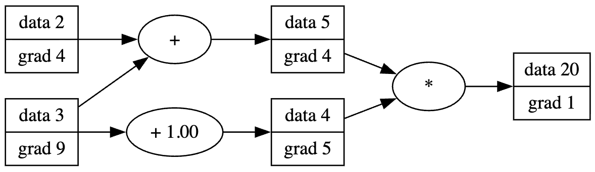
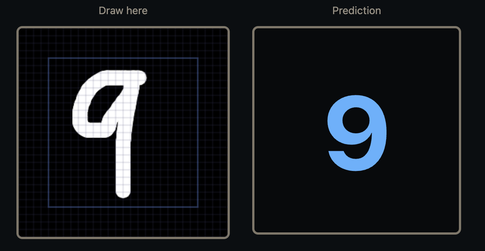

# micrograd
A small automatic differentiation engine.



## Features
- Backpropogation
- Tensor class
- Neural Net Training API
- Accelerator Support

## Build & Run
```bash
mkdir build && cd build
cmake ..
make
./main
```

## MNIST Demo
See [here](https://ravtrive.com/micrograd-demo) for demo of micrograd trained MNIST Model used for inference of drawn digits.




## Example
```c++
#include "micrograd/Tensor.h"
#include <iostream>

int main() {
  auto a = std::make_shared<Tensor>(
    std::vector<size_t>{2, 2},
    std::vector<double>{1, 2, 3, 4});

  auto b = std::make_shared<Tensor>(
    std::vector<size_t>{2, 2},
    std::vector<double>{5, 6, 7, 8});

  auto c = a->matmul(b);
  auto loss = c->sum();

  loss->backward();

  for (auto& v : c->data()){
    std::cout << v << " "; // 19 22 43 50
  }
  
  for (auto& v : a->grad()){
    std::cout << v << " "; // 11 15 11 15
  }
}
```

## Tests
Tests compare values computed from Pytorch to verify correctness.
```bash
cd build && cmake .. -DBUILD_TESTS=ON && make micrograd_tests && ctest --output-on-failure
```
