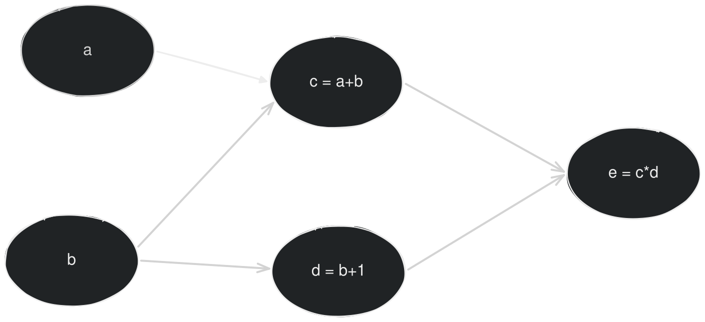
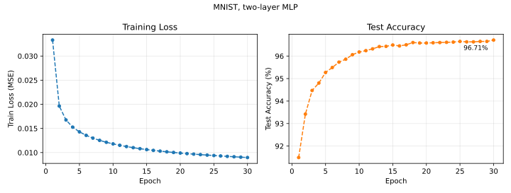

# micrograd

A small automatic differentiation engine.

```c++
#include "micrograd/Tensor.h"
#include <iostream>
using namespace micrograd;

int main() {
  auto a = std::make_shared<Tensor>(std::vector<size_t>{1}, std::vector<scalar_t>{2});
  auto b = std::make_shared<Tensor>(std::vector<size_t>{1}, std::vector<scalar_t>{1});
  a->set_requires_grad(true);
  b->set_requires_grad(true);

  auto c = a->add(b);       // 3
  auto d = b->add(1.0f);    // 2
  auto e = c->mul(d);       // 6
  e->backward();

  std::cout << e->at({0}) << "\n";                                  // 6
  std::cout << a->grad_at({0}) << " " << b->grad_at({0}) << "\n";   // 2 5
}
```

## Demo


## Build & Run

```bash
cmake -S . -B build
cmake --build build
./build/main
```

`main` trains a small network on MNIST.


## Tests

```bash
cmake -S . -B build -DBUILD_TESTS=ON
cmake --build build
ctest --test-dir build --output-on-failure
```

